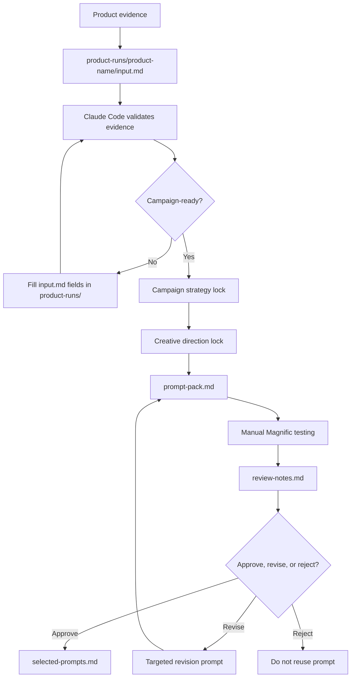

# System — Claude Code Prompt Engine Workspace

[](https://github.com/unknown19951111-max/System)
[](https://magnific.com)
[](magnific-prompt-engine/CHANGELOG.md)

A workspace for building structured, evidence-controlled product campaign
prompt packs for manual use in Magnific.

The primary system is `magnific-prompt-engine/`. It generates campaign-aware
prompt packs for **Nano Banana 2** image prompts and **Kling 2.5** video
prompts. The system does **not** automate Magnific, call an API, or guarantee
final visual quality — it creates structured prompt assets that you manually
test, review, revise, and approve.

## Who This Is For

- **Product marketers** creating campaign visuals in Magnific
- **Prompt engineers** who want structured, repeatable workflows
- **Anyone** who needs evidence-controlled prompts instead of free-form prompting

## What It Creates

**Output:** A structured `prompt-pack.md` file with copy-paste-ready image and video prompts.
You copy these into Magnific manually. The system does not generate images or video.

## What's Inside

| Directory | Role |
|---|---|
| `magnific-prompt-engine/` | Main prompt-pack system (campaign work happens here) |
| `graphify/` | Codebase graph analysis and visualization (submodule) |
| `superpowers/` | Claude Code workflow superpowers (submodule) |

| File | Role |
|---|---|
| `README.md` | This file — workspace overview |
| `CLAUDE.md` | Claude Code workspace rules |
| `instructions.md` | Workspace index and operating law |

## System Flow



**Commands used:** `/run-product-campaign [product-name]` handles validation through prompt-pack generation. `/review-output product-runs/[product-name]` handles the review step. `/revise-prompt product-runs/[product-name]` handles revision prompts.

## Quick Start

1. **Clone and initialize submodules**
   ```bash
   git clone https://github.com/unknown19951111-max/System.git
   cd System
   git submodule update --init --recursive
   ```
2. **Launch Claude Code** in the project directory (skills live there, not at root)
   ```bash
   cd magnific-prompt-engine && claude
   ```
3. **Run your first campaign**
   ```bash
   /run-product-campaign ceramic-coffee-mug
   ```
   📝 Product names use **kebab-case**: lowercase letters, hyphens instead of spaces (e.g., `biona-hypochlorous-spray`).
   
   ℹ️ **First run behavior:** If the folder doesn't exist, Claude Code creates the scaffolding and **stops**. This is expected — fill in the input file next.
4. **Fill `product-runs/[product-name]/input.md`** with your product details (name, appearance, packaging, restrictions)
5. **Run `/run-product-campaign [product-name]` again** to generate the prompt pack
6. **After testing in Magnific**, run `/review-output product-runs/[product-name]` to record approvals, revisions, or rejections
7. **Need a fix?** Run `/revise-prompt product-runs/[product-name]` for targeted revisions (document the failure in review-notes.md first)

See `magnific-prompt-engine/README.md` for a full list of what this system does and does not do.

## Submodules

```bash
git submodule update --init --recursive
```