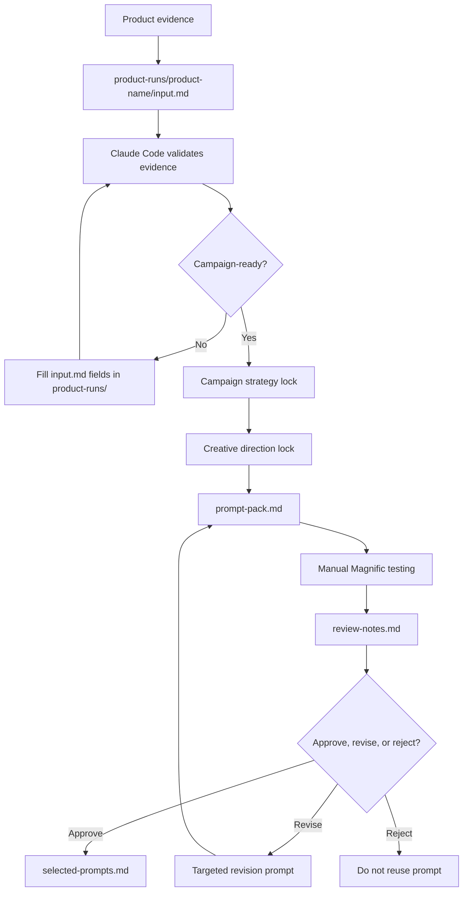

# System — Claude Code Prompt Engine Workspace

A workspace for building structured, evidence-controlled product campaign
prompt packs for manual use in Magnific.

The primary system is `magnific-prompt-engine/`. It generates campaign-aware
prompt packs for **Nano Banana 2** image prompts and **Kling 2.5** video
prompts. The system does **not** automate Magnific, call an API, or guarantee
final visual quality — it creates structured prompt assets that you manually
test, review, revise, and approve.

## What's Inside

| Directory | Role |
|---|---|
| `magnific-prompt-engine/` | Main prompt-pack system (campaign work happens here) |
| `graphify/` | Codebase graph analysis and visualization (submodule) |
| `superpowers/` | Claude Code workflow superpowers (submodule) |

## System Flow



**Commands used:** `/run-product-campaign` handles validation through prompt-pack generation. `/review-output` handles the review step. `/revise-prompt` handles revision prompts.

## Quick Start

1. Clone the repo and initialize submodules
2. Open Claude Code in the `magnific-prompt-engine/` directory (not at the repo root — skills live there)
3. Run `/run-product-campaign [product-name]` — if the folder doesn't exist, Claude Code creates the scaffolding and stops, waiting for your input
4. Fill `product-runs/[product-name]/input.md` with product evidence
5. Run `/run-product-campaign [product-name]` again to generate the prompt pack
6. Run `/review-output` to record output reviews. Approved outputs are saved to `selected-prompts.md`.

## Important Boundary

This system creates **text prompts only**. You copy them into Magnific manually.
It does not generate images, videos, or automated campaigns.
It does not integrate with Magnific APIs, Spaces, or any automation platform.

## Submodules

```bash
git submodule update --init --recursive
```