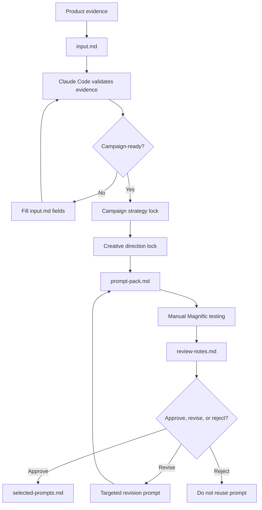
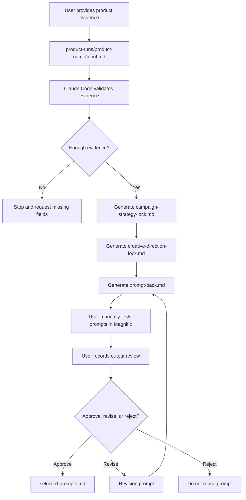

# README Audit Repair Implementation Plan

> **For agentic workers:** REQUIRED SUB-SKILL: Use superpowers:subagent-driven-development (recommended) or superpowers:executing-plans to implement this plan task-by-task.

**Goal:** Fix all 10 README audit issues — replace root README, restructure nested README with new sections and diagram, update locked order in instructions.md.

**Architecture:** Three files changed: root README.md (full replacement), magnific-prompt-engine/README.md (restructure + new sections), magnific-prompt-engine/instructions.md (update Section 81 locked order). No new files created. No code/skills/settings touched.

**Tech Stack:** Markdown, Mermaid (flowchart TD)

---

### Task 1: Update instructions.md Section 81 locked README order

**Files:**
- Modify: `magnific-prompt-engine/instructions.md` — Section 81 (around line 2978-2995) and Section 83 (around line 3316-3394)

- [ ] **Step 1: Update Section 81 — Replace old section list with new order**

Replace the current `### README.md Must Use This Exact Order` block (lines 2978-2995) with the new 19-section order:

```markdown
### README.md Must Use This Exact Order

1. What This Is
2. What This Is Not
3. How the System Works
4. Input and Output Contract
5. Accuracy Model
6. Start Here
7. New User Only Needs This
8. Responsibility Split
9. Supported Lanes
10. Example Run
11. Project Skills
12. Folder Structure
13. Quickstart: First Product Run
14. How to Paste into Magnific
15. Manual Review Loop
16. How to Save Selected Prompts
17. How to Inspect Permissions
18. Constraints
19. No Guarantees Statement

README must be operational, not marketing copy.

README must not claim guaranteed output quality.
```

- [ ] **Step 2: Update Section 81 — remove old "Run One Product Campaign" required section**

In Section 81 under `### README.md Must Include This Box`, replace the reference to `10. Run One Product Campaign command` with `11. Project Skills` (the command is now covered by the skill).

Also in Section 81 under `### README.md Must Include Permission Inspection Step`, change the old section reference from `14.` to `17.`:

Replace:
```
- README includes `/permissions` inspection step
```
With:
```
- README includes `/permissions` inspection step at section 17
```

- [ ] **Step 3: Update Section 82 quickstart — Fix start location wording**

In Section 82 (Quickstart: First Product Run), line 3301, change:

```
1. Open Claude Code in the repo root
```

To:

```
1. Open Claude Code at the repo root (not inside magnific-prompt-engine/)
```

- [ ] **Step 4: Update Section 83 — Remove mandatory command block**

Replace the massive Section 83 command block (lines 3316-3394) with:

```markdown
### 83. Run One Product Campaign

The `/run-product-campaign` skill handles both scaffolding and prompt-pack generation.

README.md must reference this skill in the Project Skills table.

Detailed command behavior is documented in the skill's SKILL.md file and the Quickstart section.
```

- [ ] **Step 5: Update acceptance checklist references**

In Section 86 (Grouped Final Acceptance Checklist), under `### New User Usability Checks`, update:

```
- README includes exact required order
```

To:

```
- README follows the updated 19-section order
```

Also find and update any old section number references (e.g., section 14 references to `How to inspect permissions`) that changed in the new order.

---

### Task 2: Replace root README with professional landing page

**Files:**
- Modify: `README.md` (root)

- [ ] **Step 1: Write the new root README**

Replace the current root README entirely with:

```markdown
# System — Claude Code Prompt Engine Workspace

A workspace for building structured, evidence-controlled product campaign
prompt packs for manual use in Magnific.

The primary system is `magnific-prompt-engine/`. It generates campaign-aware
prompt packs for **Nano Banana 2** image prompts and **Kling 2.5** video
prompts. The system does **not** automate Magnific, call an API, or guarantee
final visual quality — it creates structured prompt assets that you manually
test, review, revise, and approve.

## What's Inside

| Directory | Role |
|---|---|
| `magnific-prompt-engine/` | Main prompt-pack system (campaign work happens here) |
| `graphify/` | Codebase graph analysis and visualization (submodule) |
| `superpowers/` | Claude Code workflow superpowers (submodule) |

## System Flow



## Quick Start

1. Clone the repo and initialize submodules
2. Open Claude Code at the repo root (not inside a subdirectory)
3. Run `/run-product-campaign [product-name]`
4. Fill `product-runs/[product-name]/input.md` with product evidence
5. Run `/run-product-campaign [product-name]` again to generate the prompt pack
6. Manually test prompts in Magnific, review outputs, and save winners

## Important Boundary

This system creates **text prompts only**. You copy them into Magnific manually.
It does not generate images, videos, or automated campaigns.
It does not integrate with Magnific APIs, Spaces, or any automation platform.

## Submodules

```bash
git submodule update --init --recursive
```
```

- [ ] **Step 2: Verify start location is consistent**

Read the new root README and confirm it says "Open Claude Code at the repo root" — matching the nested README.

---

### Task 3: Restructure nested README with new sections and order

**Files:**
- Modify: `magnific-prompt-engine/README.md`

- [ ] **Step 1: Write section 1-2 — What This Is + What This Is Not**

Keep the existing content. No changes needed.

- [ ] **Step 2: Write section 3 — How the System Works (NEW Mermaid diagram)**

Insert after "What This Is Not" block:

```markdown
## How the System Works


```

- [ ] **Step 3: Write section 4 — Input and Output Contract (NEW)**

```markdown
## Input and Output Contract

| Stage | File | Purpose |
|---|---|---|
| Input | `input.md` | User-provided product facts, evidence, restrictions, and requested outputs |
| Strategy | `campaign-strategy-lock.md` | Locked campaign direction generated from verified input |
| Creative | `creative-direction-lock.md` | Locked visual direction generated from verified input |
| Prompt Pack | `prompt-pack.md` | Final copy-paste prompts for Magnific |
| Review | `review-notes.md` | User review of Magnific outputs |
| Approval | `selected-prompts.md` | Approved winning prompts only |

The system must not invent product facts. Unknown details must remain unknown.
```

- [ ] **Step 4: Write section 5 — Accuracy Model (NEW)**

```markdown
## Accuracy Model

This system separates product information into three categories:

1. **Verified facts** — directly supported by user-provided product evidence.
   Examples: product type, shape, color, logo placement, visible text.
2. **Reasonable marketing inferences** — allowed creative interpretation
   that does not create fake product claims. Examples: likely audience,
   likely campaign angle, likely visual style.
3. **Unknowns** — details that must not be presented as factual.
   Examples: exact material, certifications, price, performance claims,
   reviews, technical specifications.

Every generated prompt obeys the **Product Accuracy Lock** and **Claims Registry**
to prevent hallucinated ad claims.
```

- [ ] **Step 5: Move existing Start Here + New User Only Needs This sections**

Move the existing "Start Here" and "New User Only Needs This" sections to positions 6 and 7. Content stays the same except:

In "Start Here", change:
```
cd magnific-prompt-engine — that's where the main system lives
```
Wait — "Start Here" is in the nested README and doesn't have a `cd` command. Let me check what it says...

The current "Start Here" in the nested README just lists files. No `cd` command there. The "Quickstart: First Product Run" has "Open Claude Code in the repo root" which is already correct.

So move these sections as-is:
- Start Here → section 6 (no content change needed)
- New User Only Needs This → section 7 (no content change needed)

- [ ] **Step 6: Write section 8 — Responsibility Split (renamed)**

Replace existing "Manual vs Automated" section with:

```markdown
## Responsibility Split

| Claude Code Handles | User Handles |
|---|---|
| Product-run folder scaffolding | Product truth / evidence input |
| Placeholder file creation | Claim evidence confirmation |
| Input.md evidence validation | Magnific prompt pasting |
| Campaign strategy lock generation | Magnific model lane selection |
| Creative direction lock generation | Magnific generation |
| Prompt-pack generation | Visual quality judgment |
| Review-note formatting | Final output approval |
| Selected-prompt saving after user approval | Deciding when to update the system |
| Build health check | |
| Protected system file approval prompts | |
```

- [ ] **Step 7: Move existing Supported Lanes to section 9**

Move existing "Supported Lanes" section to position 9. Content stays the same.

- [ ] **Step 8: Write section 10 — Example Run (NEW)**

```markdown
## Example

```text
/run-product-campaign ceramic-coffee-mug
```

Claude Code creates:

```
product-runs/ceramic-coffee-mug/
├── input.md
├── campaign-strategy-lock.md
├── creative-direction-lock.md
├── prompt-pack.md
├── review-notes.md
└── selected-prompts.md
```

The user fills `input.md`, then runs:

```text
/run-product-campaign ceramic-coffee-mug
```

The system generates the campaign strategy, creative direction, and prompt pack.
```

- [ ] **Step 9: Write section 11 — Project Skills (split into normal/maintainer)**

Replace existing "Project Skills" section with:

```markdown
## Project Skills

### Normal User Commands

| Command | Use When |
|---|---|
| `/run-product-campaign [product-name]` | Start or generate a product campaign |
| `/review-output product-runs/[product-name]` | Record Magnific output review |
| `/revise-prompt product-runs/[product-name]` | Create targeted revision prompts |

### System Maintainer Commands

| Command | Use When |
|---|---|
| `/build-system` | Build or verify system structure |
| `/build-system --check` | Run a read-only system health check |
| `/update-system` | Audit or patch system files |
```

- [ ] **Step 10: Move remaining sections to positions 12-19**

Move these sections in order, content unchanged:
- Folder Structure → section 12
- Quickstart: First Product Run → section 13
- How to Paste into Magnific → section 14
- Manual Review Loop → section 15
- How to Save Selected Prompts → section 16
- How to Inspect Permissions → section 17
- Constraints → section 18
- No Guarantees Statement → section 19

Remove the "Run One Product Campaign" command block section (it's redundant with the skill and Quickstart).

- [ ] **Step 11: Final read-through verification**

Read the finished nested README and verify:
- All 19 sections present in correct order
- No old section numbering or references remain
- "Open Claude Code at the repo root" consistent with root README
- Mermaid diagram renders correctly (standard flowchart TD syntax)
- No forbidden patterns or overclaims introduced

---

### Task 4: Verification pass

- [ ] **Step 1: Read both READMEs front-to-back**

Read root README.md and magnific-prompt-engine/README.md. Verify:
- No contradictions between the two
- Start location is consistent (both say "repo root")
- New sections don't contradict instructions.md rules
- No forbidden patterns or overclaim language added

- [ ] **Step 2: Verify instructions.md still consistent**

Read magnific-prompt-engine/instructions.md Section 81 and verify the new locked order matches the actual README section order exactly.

- [ ] **Step 3: Verify git status is clean**

```bash
cd /Users/vusek/Documents/System
git diff --stat
```

Expected: 3 files changed (root README, nested README, instructions.md)