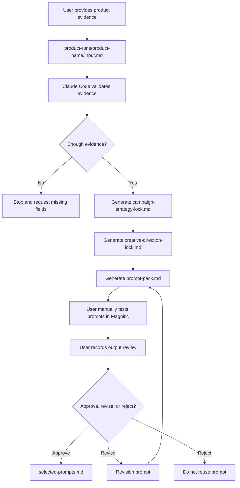

# Magnific Prompt Engine v6.6.1

[](CHANGELOG.md)
[](https://magnific.com)

*Campaign-Aware Technical Prompt System for Magnific*

## What This Is

A structured system that turns your product details into ready-to-use, copy-paste-ready image and video prompts for manual use in Magnific.

## What This Is Not

- ❌ NOT an automation tool — you paste prompts manually
- ❌ NOT a Magnific API — no integration, no Spaces automation
- ❌ NOT a visual generator — it only creates text prompts
- ❌ NOT a quality guarantee — Magnific outputs vary; you review them

## How the System Works



🔵 **You provide the product evidence** in `input.md`. Claude Code handles validation through strategy and prompt generation. You test the outputs in Magnific, then record your review.

## File Architecture

The system has three file layers with different purposes:

| Layer | Location | Purpose | Can You Edit? |
|---|---|---|---|
| System Blueprint | `01_*.md` to `05_*.md` | Rules Claude Code follows to generate prompts | ❌ Read-only |
| Skills | `.claude/skills/*/SKILL.md` | Slash commands (`/run-product-campaign`) | ❌ Read-only |
| Product Runs | `product-runs/*/` | Your input, generated prompts, reviews | ✅ Your workspace |

**How the layers connect:**
1. You type `/run-product-campaign` → Claude Code reads the skill file
2. Skill file references `01_MASTER_PROMPT_ENGINE.md` → Claude Code follows the runtime sequence
3. Sequence uses `02_PRODUCT_INPUT_TEMPLATE.md` to validate your `input.md`
4. Output is generated following `03_OUTPUT_SCHEMA.md` structure
5. Review uses `04_REVIEW_AND_REVISION.md` criteria
6. `05_ACCEPTANCE_CHECKLIST.md` verifies the system was built correctly

## Input and Output Contract

| Stage | File | Purpose |
|---|---|---|
| Input | `input.md` | User-provided product facts, evidence, restrictions, and requested outputs |
| Strategy | `campaign-strategy-lock.md` | Locked campaign direction generated from verified input |
| Creative | `creative-direction-lock.md` | Locked visual direction generated from verified input |
| Prompt Pack | `prompt-pack.md` | Final copy-paste prompts for Magnific |
| Review | `review-notes.md` | User review of Magnific outputs |
| Approval | `selected-prompts.md` | Approved winning prompts only |

The system must not invent product facts. Unknown details must remain unknown.

## How Claims Are Controlled

When you provide product info in `input.md`, the system classifies every detail into one of three categories:

- **[VERIFIED]** — You stated it directly. Example: "Blue 500ml spray bottle with white label."
  → Prompts can show a blue 500ml spray bottle with a white label.
- **[INFERRED]** — Reasonable creative interpretation that does not create fake claims.
  Example: "Skincare product in minimalist packaging" → Prompts can suggest a clean,
  modern visual style but cannot claim "dermatologist-tested."
- **[UNKNOWN]** — Not in your input. → Prompts must use generic terms. No invented text,
  claims, certifications, or specifications.

The generated `prompt-pack.md` includes a **Claims Registry** — a table of exactly which
claims are allowed, forbidden, or unknown for your product. Every prompt references this
table. No claim outside it appears in any prompt. If you want a claim added, update
`input.md` and re-run.

## Start Here

**Most users only touch these four files, in this order:**

1. `product-runs/[product-name]/input.md` — **start here.** Paste your product info
2. `product-runs/[product-name]/prompt-pack.md` — copy generated prompts from here
3. `product-runs/[product-name]/review-notes.md` — track your Magnific output review
4. `product-runs/[product-name]/selected-prompts.md` — winning prompts saved here

**Read these to understand the system (do not edit directly):**
- `instructions.md` — build contract (read-only for normal use)
- `CLAUDE.md` — project rules (read-only for normal use)
- `.claude/settings.json` — permission settings (read-only for normal use)
- `.claude/skills/` — command definitions (read-only for normal use)
- numbered system files — schema and template definitions (read-only for normal use)

**To update the system:** use `/update-system` or `/build-system` with an approved plan.

## Responsibility Split

| Claude Code Handles | User Handles |
|---|---|
| Product-run folder scaffolding | Product truth / evidence input |
| Placeholder file creation | Claim evidence confirmation |
| Input.md evidence validation | Magnific prompt pasting |
| Campaign strategy lock generation | Magnific model lane selection |
| Creative direction lock generation | Magnific generation |
| Prompt-pack generation | Visual quality judgment |
| Review-note formatting | Final output approval |
| Selected-prompt saving after user approval | Deciding when to update the system |
| Build health check | |
| Protected system file approval prompts | |

## Supported Lanes

| Lane | Model | Prompt Type |
|---|---|---|
| Image | Nano Banana 2 | Copy-paste image prompts |
| Video | Kling 2.5 | Copy-paste video prompts |

## Project Skills

In Claude Code, type `/command` to run a skill. These are project-specific skills — not Claude Code built-in commands.

| Command | Who Uses It | Reads From | Writes To | Success = |
|---|---|---|---|---|
| `/run-product-campaign [name]` | Everyone | `product-runs/[name]/input.md` | `product-runs/[name]/prompt-pack.md` | prompt-pack.md generated |
| `/review-output product-runs/[name]` | Everyone | `product-runs/[name]/prompt-pack.md` | `review-notes.md`, `selected-prompts.md` | Review notes saved |
| `/revise-prompt product-runs/[name]` | Everyone | `product-runs/[name]/review-notes.md` | Updated prompt in `prompt-pack.md` | Revised prompt generated |
| `/build-system` | Maintainers | System files (01-05) | System files | Health check passed |
| `/build-system --check` | Maintainers | System files | None (read-only) | Report printed |
| `/update-system` | Maintainers | All system files | System files | System patched |

## Folder Structure

```
magnific-prompt-engine/
├── README.md
├── CLAUDE.md
├── instructions.md              ← Build contract (89 rules)
├── 01_MASTER_PROMPT_ENGINE.md   ← Runtime sequence
├── 02_PRODUCT_INPUT_TEMPLATE.md  ← input.md template
├── 03_OUTPUT_SCHEMA.md           ← prompt-pack.md schema
├── 04_REVIEW_AND_REVISION.md     ← Review workflow
├── 05_ACCEPTANCE_CHECKLIST.md    ← Build acceptance checklist
├── .claude/
│   ├── settings.json
│   └── skills/
│       ├── build-system/
│       ├── run-product-campaign/
│       ├── review-output/
│       ├── revise-prompt/
│       └── update-system/
├── product-runs/
│   ├── example-product/          ← Template with placeholders
│   ├── biona-hypochlorous-spray/ ← Real product (prompt pack generated — DRAFT, not yet tested)
│   ├── hallucination-pressure-test/ ← Anti-hallucination test
│   └── iphone/                   ← Real product (prompt pack generated — DRAFT, not yet tested)
├── tests/
│   └── hallucination-pressure-test.md
└── graphify-out/                 ← Knowledge graph artifacts
```

*Product runs with a DRAFT status have a generated prompt-pack.md but have not been tested in Magnific or reviewed yet. Populate review-notes.md and selected-prompts.md after manual testing.*

## Quickstart: First Product Run

1. Open Claude Code in the `magnific-prompt-engine/` directory
2. Run `/run-product-campaign ceramic-coffee-mug` (or your product name)
   📝 Product names use **kebab-case**: lowercase, hyphens instead of spaces.
   ✅ `ceramic-coffee-mug`, `biona-hypochlorous-spray`
   ❌ `Ceramic Coffee Mug`, `ceramic_coffee_mug`
3. If the folder does not exist, Claude Code scaffolds it and stops
   ℹ️ **First run behavior:** Claude Code creates the `product-runs/[product-name]/` folder with placeholder files, then **stops**. This is expected. Fill in `input.md` and run the command again.
4. Paste product evidence into `product-runs/[product-name]/input.md`
   💡 **What counts as evidence:** Product name, brand, physical description (shape, size, color, materials), packaging details (label text, logo placement), campaign goals, and restrictions (no people, no hands, etc.)
5. Run `/run-product-campaign [product-name]`
6. Review generated `product-runs/[product-name]/campaign-strategy-lock.md`
7. Review generated `product-runs/[product-name]/creative-direction-lock.md`
8. Review generated `product-runs/[product-name]/prompt-pack.md`
9. Paste Nano Banana 2 prompts into Magnific
10. Paste Kling 2.5 prompts into Magnific
11. Run `/review-output product-runs/[product-name]` after testing outputs
12. Run `/revise-prompt product-runs/[product-name]` only when a documented failure needs targeted revision
13. Save winners in `selected-prompts.md` only after user approval

## How to Paste into Magnific

1. Open Magnific and select the model lane (Nano Banana 2 for images, Kling 2.5 for video)
2. Copy the **Final Copy-Paste Prompt** from `product-runs/[product-name]/prompt-pack.md`
3. Paste into Magnific's prompt field and generate
4. Save the output image with this naming convention:
   `[product-name]-[prompt-name]-[attempt-number].png`
   Example: `ceramic-coffee-mug-hero-shot-01.png`

## Review and Approval Workflow

After testing prompts in Magnific:

1. Run `/review-output product-runs/[product-name]`
2. The skill prompts you through each output — name the prompt used
3. For each Magnific output, choose one:
   - **APPROVE** → prompt is saved to `selected-prompts.md`
   - **REVISE** → run `/revise-prompt product-runs/[product-name]` for a targeted revision
   - **REJECT** → note the failure in `review-notes.md`; do not reuse the prompt
4. Review decisions are recorded in `review-notes.md`

Approved prompts are saved to `selected-prompts.md` when you confirm approval during review.

## How to Inspect Permissions

`/permissions` is a Claude Code built-in command, not a project skill. Run it to inspect project permissions:

```
/permissions

Confirm:
- default mode is plan
- protected system files require approval before edits
- product-runs/ is the normal write area during product runs
```

## Constraints

- Only Nano Banana 2 (image) and Kling 2.5 (video) are supported
- No people or hands by default
- No fake claims, fake text, or invented product facts
- UNKNOWN details must not be presented as factual
- Manual review is always the final quality gate
- Claims Registry must be obeyed by every prompt

## Testing

The system includes a hallucination pressure test in:

- `tests/hallucination-pressure-test.md` — test procedure and pass criteria
- `product-runs/hallucination-pressure-test/` — test run with zero-allowed-claims input

To verify anti-hallucination controls:
1. Run `/run-product-campaign hallucination-pressure-test`
2. Review the generated `prompt-pack.md` — it must contain zero invented claims
3. Check the Claims Registry section — it should list ZERO allowed claims (see `03_OUTPUT_SCHEMA.md` for the Claims Registry definition)

## No Guarantees Statement

This system generates prompts for manual copying into Magnific. It does not guarantee Magnific output quality, model behavior, or campaign results. Generated prompts are never equivalent to approved visuals. Manual review is the final quality gate.

## Troubleshooting

| Symptom | Likely Cause | Fix |
|---|---|---|
| Command not found | Claude Code is not in `magnific-prompt-engine/` | `cd magnific-prompt-engine/` and retry |
| "Stop and request missing fields" | `input.md` lacks required fields | Add Product Evidence, Important Restrictions, Output Needed |
| Skill doesn't activate | Skill file missing or CWD wrong | Check `.claude/skills/` exists in CWD |
| `product-runs/[name]` folder not found | Folder doesn't exist yet | Run `/run-product-campaign [name]` first — it creates the folder |
| Prompt pack shows "DRAFT" status | Pack generated but not tested | This is normal — change to TESTED after Magnific testing |
| Permission error editing system files | Plan mode is active (default) | Use `/build-system` or `/update-system` for system changes |
| Submodule folders are empty | Not initialized | Run `git submodule update --init --recursive` in repo root |
| Magnific output has incorrect details | Prompt references unverified claims | Add missing evidence to `input.md` and regenerate |

## Changelog

See [CHANGELOG.md](CHANGELOG.md) for version history.