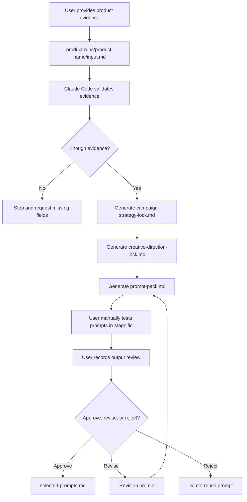

# Magnific Prompt Engine v6.6.1

## What This Is

A **deterministic workflow and schema-guided prompt-pack builder** for generating campaign-aware, copy-paste-ready prompts for manual use in Magnific.

## What This Is Not

- ❌ NOT an automation tool — you paste prompts manually
- ❌ NOT a Magnific API — no integration, no Spaces automation
- ❌ NOT a visual generator — it only creates text prompts
- ❌ NOT a quality guarantee — Magnific outputs vary; you review them

## How the System Works



## Input and Output Contract

| Stage | File | Purpose |
|---|---|---|
| Input | `input.md` | User-provided product facts, evidence, restrictions, and requested outputs |
| Strategy | `campaign-strategy-lock.md` | Locked campaign direction generated from verified input |
| Creative | `creative-direction-lock.md` | Locked visual direction generated from verified input |
| Prompt Pack | `prompt-pack.md` | Final copy-paste prompts for Magnific |
| Review | `review-notes.md` | User review of Magnific outputs |
| Approval | `selected-prompts.md` | Approved winning prompts only |

The system must not invent product facts. Unknown details must remain unknown.

## Accuracy Model

This system separates product information into three categories:

1. **Verified facts** — directly supported by user-provided product evidence.
   Examples: product type, shape, color, logo placement, visible text.
2. **Reasonable marketing inferences** — allowed creative interpretation
   that does not create fake product claims. Examples: likely audience,
   likely campaign angle, likely visual style.
3. **Unknowns** — details that must not be presented as factual.
   Examples: exact material, certifications, price, performance claims,
   reviews, technical specifications.

Every generated prompt obeys the **Product Accuracy Lock** and **Claims Registry**
to prevent hallucinated ad claims.

## Start Here

**Most users only touch:**

1. `product-runs/[product-name]/input.md` — paste product info here
2. `product-runs/[product-name]/prompt-pack.md` — copy prompts from here
3. `product-runs/[product-name]/review-notes.md` — track review results
4. `product-runs/[product-name]/selected-prompts.md` — save winning prompts

**Read these to understand the system (do not edit directly):**
- `instructions.md` — build contract (read-only for normal use)
- `CLAUDE.md` — project rules (read-only for normal use)
- `.claude/settings.json` — permission settings (read-only for normal use)
- `.claude/skills/` — command definitions (read-only for normal use)
- numbered system files — schema and template definitions (read-only for normal use)

**To update the system:** use `/update-system` or `/build-system` with an approved plan.

## Responsibility Split

| Claude Code Handles | User Handles |
|---|---|
| Product-run folder scaffolding | Product truth / evidence input |
| Placeholder file creation | Claim evidence confirmation |
| Input.md evidence validation | Magnific prompt pasting |
| Campaign strategy lock generation | Magnific model lane selection |
| Creative direction lock generation | Magnific generation |
| Prompt-pack generation | Visual quality judgment |
| Review-note formatting | Final output approval |
| Selected-prompt saving after user approval | Deciding when to update the system |
| Build health check | |
| Protected system file approval prompts | |

## Supported Lanes

| Lane | Model | Prompt Type |
|---|---|---|
| Image | Nano Banana 2 | Copy-paste image prompts |
| Video | Kling 2.5 | Copy-paste video prompts |

## Project Skills

### Normal User Commands

| Command | Use When |
|---|---|
| `/run-product-campaign [product-name]` | Start or generate a product campaign |
| `/review-output product-runs/[product-name]` | Record Magnific output review |
| `/revise-prompt product-runs/[product-name]` | Create targeted revision prompts |

### System Maintainer Commands

| Command | Use When |
|---|---|
| `/build-system` | Build or verify system structure |
| `/build-system --check` | Run a read-only system health check |
| `/update-system` | Audit or patch system files |

## Folder Structure

```
magnific-prompt-engine/
├── README.md
├── CLAUDE.md
├── instructions.md              ← Build contract (89 rules)
├── 01_MASTER_PROMPT_ENGINE.md   ← Runtime sequence
├── 02_PRODUCT_INPUT_TEMPLATE.md  ← input.md template
├── 03_OUTPUT_SCHEMA.md           ← prompt-pack.md schema
├── 04_REVIEW_AND_REVISION.md     ← Review workflow
├── 05_ACCEPTANCE_CHECKLIST.md    ← Definition of done
├── .claude/
│   ├── settings.json
│   └── skills/
│       ├── build-system/
│       ├── run-product-campaign/
│       ├── review-output/
│       ├── revise-prompt/
│       └── update-system/
├── product-runs/
│   ├── example-product/          ← Template with placeholders
│   ├── biona-hypochlorous-spray/ ← Real product (complete)
│   ├── hallucination-pressure-test/ ← Anti-hallucination test
│   └── iphone/                   ← Real product (complete)
├── tests/
│   └── hallucination-pressure-test.md
└── graphify-out/                 ← Knowledge graph artifacts
```

## Quickstart: First Product Run

1. Open Claude Code in the `magnific-prompt-engine/` directory
2. Run `/run-product-campaign ceramic-coffee-mug` (or your product name)
3. If the folder does not exist, Claude Code scaffolds it and stops
4. Paste product evidence into `product-runs/[product-name]/input.md`
5. Run `/run-product-campaign [product-name]`
6. Review generated `campaign-strategy-lock.md`
7. Review generated `creative-direction-lock.md`
8. Review generated `prompt-pack.md`
9. Paste Nano Banana 2 prompts into Magnific
10. Paste Kling 2.5 prompts into Magnific
11. Run `/review-output product-runs/[product-name]` after testing outputs
12. Run `/revise-prompt product-runs/[product-name]` only when a documented failure needs targeted revision
13. Save winners in `selected-prompts.md` only after user approval

## How to Paste into Magnific

Open Magnific, select the lane (Nano Banana 2 or Kling 2.5), copy the **Final Copy-Paste Prompt** from `prompt-pack.md`, paste into the prompt field, generate, and name the output file with the prompt name for tracking.

## Manual Review Loop

For each Magnific output:
1. Name the prompt used
2. Mark **APPROVE**, **REVISE**, or **REJECT**
3. Select the failure type
4. Write one sentence explaining the issue
5. If REVISE, run `/revise-prompt` for a targeted revision
6. If APPROVE, run `/review-output` to save to selected-prompts.md

## How to Save Selected Prompts

After a prompt output is approved:
1. Run `/review-output product-runs/[product-name]`
2. Confirm the prompt name and output reference
3. Use approval wording: `Approve this output and save it.`
4. The prompt will be saved to `selected-prompts.md`

## How to Inspect Permissions

To inspect project permissions, run:

```
/permissions

Confirm:
- default mode is plan
- protected system files require approval before edits
- product-runs/ is the normal write area during product runs
```

## Constraints

- Only Nano Banana 2 (image) and Kling 2.5 (video) are supported
- No people or hands by default
- No fake claims, fake text, or invented product facts
- UNKNOWN details must not be presented as factual
- Manual review is always the final quality gate
- Claims Registry must be obeyed by every prompt

## Testing

The system includes a hallucination pressure test in:

- `tests/hallucination-pressure-test.md` — test procedure and pass criteria
- `product-runs/hallucination-pressure-test/` — test run with zero-allowed-claims input

To verify anti-hallucination controls:
1. Run `/run-product-campaign hallucination-pressure-test`
2. Review the generated `prompt-pack.md` — it must contain zero invented claims
3. Check the Claims Registry section — it should list ZERO allowed claims

## No Guarantees Statement

This system generates prompts for manual copying into Magnific. It does not guarantee Magnific output quality, model behavior, or campaign results. Generated prompts are never equivalent to approved visuals. Manual review is the final quality gate.

## Troubleshooting

| Symptom | Likely Cause | Fix |
|---|---|---|
| Command not found | Claude Code is not in `magnific-prompt-engine/` | `cd magnific-prompt-engine/` and retry |
| "Stop and request missing fields" | `input.md` lacks required fields | Add Product Evidence, Important Restrictions, Output Needed |
| Skill doesn't activate | Skill file missing or CWD wrong | Check `.claude/skills/` exists in CWD |

## Changelog

See [CHANGELOG.md](CHANGELOG.md) for version history.